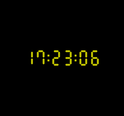
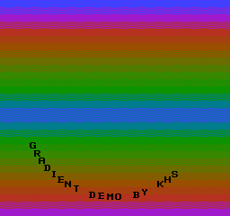
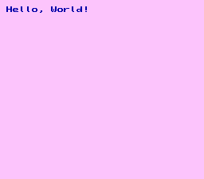
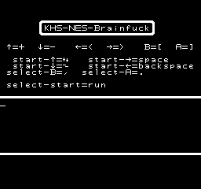

# nes-homebrew

My 6502 assembly programs for the [Nintendo Entertainment System](http://en.wikipedia.org/wiki/Nintendo_Entertainment_System) (NES). Only tested on [FCEUX](http://www.fceux.com). Assembled programs are in `binaries.zip`.

Thanks to [pdroms.de](https://pdroms.de) for archiving some of these programs.

## How to assemble
* Install **asm6f**:
  * [GitHub page](https://github.com/freem/asm6f)
  * [64-bit Windows binary](http://qallee.net/misc/asm6f-win64.zip) (compiled by me)
* Assemble: `asm6f file.asm file.nes`

## The programs

### Clock
A 24-hour 7-segment clock. NTSC/PAL support.



### Color Squares
Prints colored squares. On each frame, two adjacent squares trade places.

Does not work at the moment.


### Gradient Demo
Prints an animated gradient and moving text. Warning: you may get a seizure.



### Hello World
Prints *Hello, World!*.



### KHS-NES-Brainfuck
A Brainfuck interpreter. The programs can use 256 bytes of RAM. Spaces are for readability only.



### Trans flag
89 bytes (including interrupt vectors and CHR data).


The complete program in hexadecimal:
```
8e 00 20 c8 2c 02 20 10 fb 88 10 f8 a0 02 a2 18
8d 07 20 ca d0 fa a9 ff 88 d0 f3 a9 3f 8d 06 20
8e 06 20 a0 03 b9 f8 ff 8d 07 20 88 10 f7 a9 20
8d 06 20 8e 06 20 a0 05 b9 f2 ff a2 c0 8d 07 20
ca d0 fa 88 10 f2 a9 0a 8d 01 20 00 01 02 00 02
01 25 21 00 30 a7 ff f2 ff
```

## References
* [NESDev Wiki &ndash; init code](http://wiki.nesdev.com/w/index.php/Init_code)
* [NESDev Wiki &ndash; CPU power up state](http://wiki.nesdev.com/w/index.php/CPU_power_up_state)
* [NESDev Wiki &ndash; PPU registers](http://wiki.nesdev.com/w/index.php/PPU_registers)
* [Wikipedia &ndash; Brainfuck](https://en.wikipedia.org/wiki/Brainfuck)
* [Esolang &ndash; Brainfuck](https://esolangs.org/wiki/Brainfuck)

