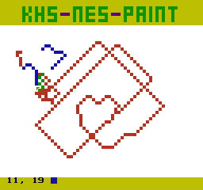

# nes-homebrew

My 6502 assembly programs for the [Nintendo Entertainment System](http://en.wikipedia.org/wiki/Nintendo_Entertainment_System) (NES).

Thanks to [pdroms.de](https://pdroms.de) for archiving some of these programs.

## How to assemble
* Install **asm6f**:
  * [GitHub page](https://github.com/freem/asm6f)
  * [64-bit Windows binary](http://qallee.net/misc/asm6f-win64.zip) (compiled by me)
* Either run the program's batch file (only works on Windows) or assemble manually: `asm6f file.asm file.nes`

## The programs
Assembled programs are in `binaries.zip`.

### 24 Balls
Shows 24 bouncing balls.

Files:
* `24balls.asm`: old version (assembled file is identical to the version I created in early 2010s)
* `24balls-new.asm`: new version (uses about 900 bytes of PRG ROM)

### Clock
A 24-hour 7-segment clock. NTSC/PAL support.

### Color Squares
Prints colored squares. On each frame, two adjacent squares trade places.

### Gradient Demo
Prints an animated gradient and moving text. Warning: you may get a seizure.

### Hello World
Prints *Hello, World!*. Only tested on [FCEUX](http://www.fceux.com).

### KHS-NES-Brainfuck
A Brainfuck interpreter. The programs can use 256 bytes of RAM. Spaces are for readability only.

### KHS-NES-Paint
A paint program. 64&times;48 "pixels", 4 colors, palette editor, 1&times;1-pixel or 2&times;2-pixel brush.

## References
* [NESDev Wiki &ndash; init code](http://wiki.nesdev.com/w/index.php/Init_code)
* [NESDev Wiki &ndash; PPU registers](http://wiki.nesdev.com/w/index.php/PPU_registers)
* [Wikipedia &ndash; Brainfuck](https://en.wikipedia.org/wiki/Brainfuck)
* [Esolang &ndash; Brainfuck](https://esolangs.org/wiki/Brainfuck)
