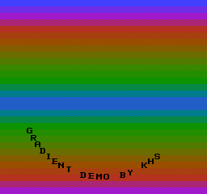
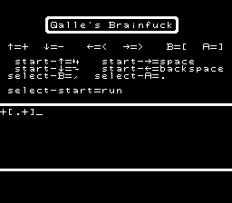
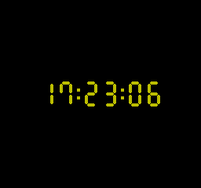
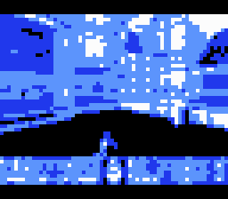
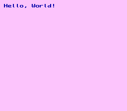

# nes-homebrew

Programs for the [NES](https://en.wikipedia.org/wiki/Nintendo_Entertainment_System).
Thanks to [PDRoms](https://pdroms.de) for archiving some of these programs.

Table of contents:
* [Files for each program](#files-for-each-program)
* [The programs](#the-programs)
  * [Gradient Demo](#gradient-demo)
  * [Qalle's Brainfuck](#qalles-brainfuck)
  * [Clock](#clock)
  * [Video](#video)
  * [Hello World](#hello-world)
  * [Transgender flag](#transgender-flag)

## Files for each program

* `example.asm`: source code (assembles with [ASM6](https://www.romhacking.net/utilities/674/))
* `example-assemble.sh`: Linux script that assembles the program (warning: deletes files)
* `example-chr.bin.gz`: raw CHR ROM data (gzip compressed)
* `example-chr.png`: CHR ROM data as an image (can be encoded with `nes_chr_encode.py` in my [NES utilities](https://github.com/qalle2/nes-util))
* `example.nes.gz`: assembled program (iNES format, gzip compressed)
* `example.png`: screenshot

## The programs

### Gradient Demo
Shows an animated gradient and moving text.
Warning: you may get a seizure.



### Qalle's Brainfuck
A Brainfuck interpreter.
The programs can use 256 bytes of RAM.
Spaces are for readability only.



See `brainfuck-examples.txt` for some programs.

References:
* [Wikipedia &ndash; Brainfuck](https://en.wikipedia.org/wiki/Brainfuck)
* [Esolang &ndash; Brainfuck](https://esolangs.org/wiki/Brainfuck)

### Clock
A 24-hour 7-segment clock. Runs at 60.1 frames per second.



There are two modes:
* adjust mode:
  * program starts in this mode
  * time does not advance
  * cursor (up arrow) is visible
  * press left/right to move cursor
  * press up/down to change digit at cursor
  * press start to switch to run mode (hour must be 23 or less)
* run mode:
  * time advances
  * cursor is hidden
  * press start to switch to adjust mode

The actual size (PRG + CHR ROM) is less than 1.5 KiB.

### Video
Plays a short video of Doom gameplay (64&times;48 pixels, 4 colors, 10 fps, no audio).



### Hello World
Prints *Hello, World!*.



### Transgender flag
Shows the transgender flag.
Note: this program is heavily optimized for size; it does not represent good programming practice.
The actual size is 95 bytes (including interrupt vectors and CHR data).


The program in hexadecimal:
```
a2038e00202c022010fbcad0f88a20f1
ffa002a2188d0720cad0faa9ff88d0f3
a93f20f1ffa003b9f8ff8d07208810f7
a92020f1ffa005b9ebffa2c08d0720ca
d0fa8810f2a90a8d0120000102000201
8d06208e06206025210030a1ffebff
```
